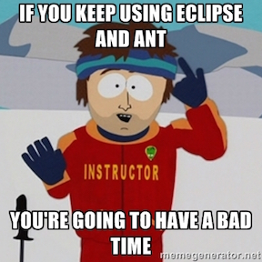

class: center, middle, title-slide
# Gradle and the new Android Build System
**Patrick Hammond**  
patrick@madebyatomicrobot.com  
@patrickhammond
.brand-logo[Atomic Robot]
.license[.name[Creative Commons Attribution-ShareAlike 4.0 International] .logo[CC-BY-SA]]

---

class: center
## You can find the presentation and sample code on GitHub:
https://github.com/patrickhammond/Presentation-AndroidGradle

### Sample code is aimed to drive discussion and show concepts only. It is not polished so use with caution.

---

.wide-left-column[
.portrait[]
]
.thin-right-column[
## Who am I?
- 5+ years building Android apps
- Atomic Robot founding partner
- Husband, Dad, Geek, Insomniac, Cook, Capsaicin Lover, Craft Beer Fan
]

---

class: center, middle
# Overview
## *"What is it, why should I care, and when can I use it?"*

---

.left-column[
## What is it?
]
.right-column[
.center[]
> ## "Gradle is an advanced build toolkit that manages dependencies and allows you to define custom build logic."
]
.footnote[https://developer.android.com/tools/building/plugin-for-gradle.html]

---

.left-column[
## What is it?
]
.right-column[
## History
- ### Android Gradle plugin work started in early 2013
- ### Finally left beta with 1.0 in Dec 2014

## Interesting
- ### Jason Voegele created an Android Gradle plugin prior to Google's work   
]
.footnote[https://github.com/jvoegele/gradle-android-plugin] 

---

.left-column[
## What is it?
## Why should I care?
]
.right-column[
.center[]
]

---

.left-column[
## What is it?
## Why should I care?
]
.right-column[
## Support
- ### Gradle/Android Studio are supported tools moving forward
- ### Ant/Eclipse will **not** receive significant support in the future
- ### Alternative: Maven support is good but lags behind Android tooling updates
  - ### Poor Android/Eclipse/Maven integration
]

---

.left-column[
## What is it?
## Why should I care?
]
.right-column[
## New Build System Goals
- ### Make it easy to reuse code and resources
- ### Make it easy to create several variants of an application, either for multi-apk distribution or for different flavors of an application
- ### Make it easy to configure, extend and customize the build process
- ### Good IDE integration
]
.footnote[http://tools.android.com/tech-docs/new-build-system/user-guide] 

---

.left-column[
## What is it?
## Why should I care?
## When can I use it?
]
.right-column[
> ### "I tried it before and my project broke with every plugin update..."
--Any Android developer who tried Gradle before 1.0

.center[]
]

---

.left-column[
## What is it?
## Why should I care?
## When can I use it?
]
.right-column[
## Great news!
- ### No longer in beta (Dec 2014)
- ### Breaking changes should now be rare
> ### "Starting with Android Studio 1.0 and the Gradle plugin for Android 1.0, compatibility is a critical requirement."
]
.footnote[http://tools.android.com/tech-docs/new-build-system/version-compatibility]

---

class: center, middle
# Getting Started
## *"What do I need, why are things different, what are all the new files, and how do I start making it work for me?"*

---

.left-column[
## Software
]
.right-column[
- ### Android SDK, Java, etc
- ### Must use Android Studio (1.0+)
  - ### IntelliJ probably works too
  - ### Eclipse won't work (Feb 2015)
]

---

.left-column[
## Software
## Project
]
.right-column[
- ### Standard project structure
- ### TODO
]

---

.left-column[
## Software
## Project
## Files
]
.right-column[
- ### Gradle files
- ### multiple build.gradle files, settings.gradle, gradlew, gradle.properties, gradle wrapper, etc
]

---

.left-column[
## Software
## Project
## Files
## Example
]
.right-column[
- ### Add Play Services and the support library to an app
- ### TODO Snippet
]

---

class: center, middle
# Migrating from Eclipse
## *"I'm sold! How do I get off Eclipse?"*

---

.left-column[
## Version Control
]
.right-column[
- ### If you're using version control and want to preserve history DO NOT use the tooling migration scripts to migrate to Gradle; they won't preserve history (as of Jan 2014).
  - ### TODO Snippet
  - ### Drop down to the CLI and use the VCS commands to move things around (ex: `git mv AndroidManifest app/src/main/AndroidManifest.xml`)
  - ### TODO Sample migration snippet
      - TODO: Gradle wrapper https://github.com/mgrzechocinski/dagger2-example/blob/master/build.gradle
]

---

.left-column[
## Version Control
## Tool Differences
]
.right-column[
- ### If you're used to having library projects your app depends on open in your workspace, those are correctly managed now without needing to awkwardly keep them open just to build your app.
]

---

class: center, middle
# Using the Android Plugin
## *"How do I really start using this thing?"*

---

.left-column[
## Syntax
]
.right-column[
### Why does this look different?
- ### Gradle files are written in the Groovy language.
- ### Having a slight familiarity with the Groovy language can be helpful for more advanced project setup.
]
.footnote[http://groovy.codehaus.org]

---

.left-column[
## Syntax
## Plugin Docs
]
.right-column[
### There are lots of configuation options!
### Recommend you download the documentation because it isn't accessible in Android Studio.
### Steps:
1. Go to https://developer.android.com/tools/building/plugin-for-gradle.html
1. Download the "Plugin Language Reference" from the right side of the page.
1. Unzip.
1. Open up index.html
1. Browse like you would JavaDocs.
]

---

.left-column[
## Syntax
## Plugin Docs
## Gradle Wrapper
]
.right-column[
### Use the Gradle wrapper and make sure it is checked into VCS
]

---

.left-column[
## Syntax
## Plugin Docs
## Gradle Wrapper
## Gradle Daemon
]
.right-column[
### Gradle daemon
]

---

.left-column[
## Syntax
## Plugin Docs
## Gradle Wrapper
## Gradle Daemon
## Issues
]
.right-column[
### Outstanding Issues
- ### AAR vs APKLIB (Maven) incompatibility is still an issue
- ### Tooling errors can sometimes (frequently) be cryptic
- ### Thorough documentation and relevant (recent) StackOverflow posts still improving
]

---

class: center, middle
# Intermediate features
## *"Boring! Show me the cool stuff!"*

---

.left-column[
## Build flavors
]
.right-column[
### Build flavors (paid vs free, Google vs Amazon)
]

---

.left-column[
## Build flavors
## Build variants
]
.right-column[
### Build variants (production vs debug)
]

---

.left-column[
## Build flavors
## Build variants
## BuildConfig
]
.right-column[
### Build time constants
]

---

.left-column[
## Build flavors
## Build variants
## BuildConfig
## Scripting
]
.right-column[
### Scriptability
]

---

.left-column[
## Build flavors
## Build variants
## BuildConfig
## Scripting
## Optimizations
]
.right-column[
### Ex: shrinkResources
]

---

class: center, middle
# Easy Integrations
## *"Show me the money!"*

---

.left-column[
## ProGuard Hell
]
.right-column[
https://github.com/krschultz/android-proguard-snippets
- Not dynamic, but improves readability
]

---

.left-column[
## ProGuard Hell
## Quality
]
.right-column[
### Quality Tools - Lint
]

---

.left-column[
## ProGuard Hell
## Quality
]
.right-column[
### Quality Tools - FindBugs
]

---

.left-column[
## ProGuard Hell
## Quality
]
.right-column[
### Quality Tools - PMD
]

---

.left-column[
## ProGuard Hell
## Quality
## Version checks
]
.right-column[
### Ensuring dependency versions are up to date
]

---

.left-column[
## ProGuard Hell
## Quality
## Version checks
]
.right-column[
### Preventing wild card dependencies
### https://gist.github.com/JakeWharton/2066f5e4f08fbaaa68fd
]

---

.left-column[
## ProGuard Hell
## Quality
## Version checks
## Productivity
]
.right-column[
### http://gradleplease.appspot.com
]

---

### Useful links

#### Documentation
- https://gradle.org
- https://developer.android.com/sdk/installing/studio-build.html
- https://developer.android.com/tools/building/plugin-for-gradle.html
- http://tools.android.com/tech-docs/new-build-system/user-guide

#### Videos
- "Dive into the Gradle-based Android Build System"  
https://www.youtube.com/watch?v=popb1n1_fA8

#### Interesting Gradle files/snippets
- Project configuration utilizing interesting features
  https://github.com/LiveTyping/u2020-mvp/blob/master/app/build.gradle
- Adding Android support annotations to a plain Java module  
https://gist.github.com/JakeWharton/e8a3685feb6a94b23393

---

class: center, middle
# Questions?

# Thank you!

---
